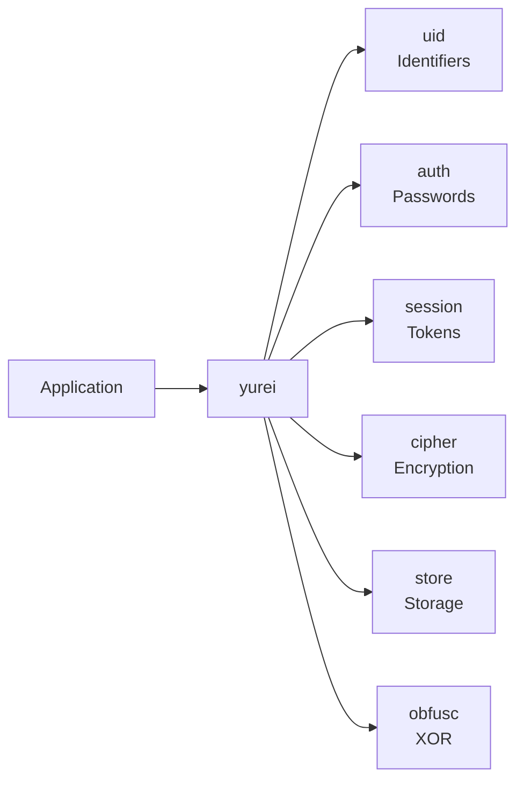
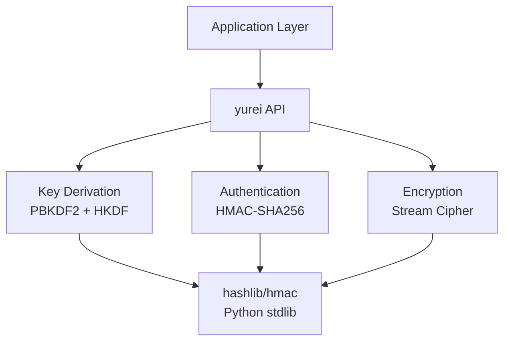

<div align="center">

# yurei
**Zero-dependency Python cryptography library**

[](https://github.com/ogkae/yurei) [](https://www.python.org) [](./LICENSE) [](https://github.com/ogkae/yurei/stargazers)

*Lightweight cryptographic primitives for modern Python applications*

</div>

---

## Table of Contents

- [Overview](#overview)
- [Installation](#installation)
- [Quick Start](#quick-start)
- [API Reference](#api-reference)
- [Security](#security)
- [Examples](#examples)
- [Contributing](#contributing)

---

## Overview

Yurei provides cryptographic utilities without external dependencies. Designed for prototyping, internal tools, and environments with restricted package installation.

```python
from yurei import encrypt_bytes, create_token, hash_password

encrypted = encrypt_bytes(b"secret", b"password")
token = create_token({"user": "alice"}, b"key", ttl_seconds=3600)
pwd_hash = hash_password("SecurePass123")
```

> **Note:** For production systems, prefer audited libraries like [`cryptography`](https://cryptography.io/) with AES-GCM or ChaCha20-Poly1305.

### Architecture



### Features

| Module | Purpose | Algorithms |
|--------|---------|------------|
| **uid** | UUID4, deterministic IDs, short tokens | SHA256, CSPRNG |
| **auth** | Password hashing | PBKDF2-HMAC-SHA256 (200k iter) |
| **session** | Signed tokens with expiration | HMAC-SHA256 |
| **cipher** | Authenticated encryption + parallel mode | HMAC-based stream |
| **store** | Key-value storage (memory/SQLite) | WAL mode, JSON |
| **obfusc** | XOR obfuscation (non-cryptographic) | XOR + Base64 |

---

## Installation

```bash
git clone https://github.com/ogkae/yurei
cd yurei
pip install -e .
```

**Requirements:** Python 3.10+

---

## Quick Start

```python
from yurei import (
    uuid4, hash_password, verify_password,
    create_token, verify_token,
    encrypt_bytes, decrypt_bytes,
    KVStore
)
import os

# Generate IDs
user_id = uuid4()

# Hash & verify passwords
pwd_hash = hash_password("SecurePass123")
is_valid = verify_password(pwd_hash, "SecurePass123")

# Create & verify tokens
secret = os.urandom(32)
token = create_token({"uid": user_id}, secret, ttl_seconds=3600)
payload = verify_token(token, secret)

# Encrypt & decrypt
encrypted = encrypt_bytes(b"data", b"passphrase")
decrypted = decrypt_bytes(encrypted, b"passphrase")

# Store data
db = KVStore("data.db")
db.set("key", {"value": "data"})
data = db.get("key")
```

---

## API Reference

<details>
<summary><code>uid</code> - Identifier Generation</summary>

```python
uuid4() -> str                                          # Random UUID4
is_uuid4(s: str) -> bool                                # Validate UUID4
sha256_id(namespace: str, name: str, salt: str) -> str  # Deterministic ID (64 hex)
short_id(length: int = 12) -> str                       # URL-safe token
```

</details>

<details>
<summary><code>auth</code> - Password Hashing</summary>

```python
hash_password(password: str, iterations: int = 200_000) -> str
# Returns: pbkdf2$<iterations>$<salt_b64>$<hash_b64>

verify_password(stored: str, attempt: str) -> bool
# Constant-time comparison
```

**Parameters:**
- 200k iterations (default)
- 16-byte salt
- 32-byte derived key

</details>

<details>
<summary><code>session</code> - Token Management</summary>

```python
create_token(payload: Dict[str, str], secret: bytes, ttl_seconds: int) -> str
# Format: <payload_b64>.<signature_b64>

verify_token(token: str, secret: bytes) -> Optional[Dict[str, str]]
# Returns payload if valid, None otherwise
```

**Features:**
- HMAC-SHA256 signature
- Automatic expiration
- Lightweight (not JWT-compatible)

</details>

<details>
<summary><code>cipher</code> - Encryption</summary>

```python
encrypt_bytes(plaintext: bytes, key: bytes) -> str
# Key: passphrase (any length) or raw 32-byte key
# Returns: base64url(salt + nonce + ciphertext + mac)

decrypt_bytes(blob_b64: str, key: bytes) -> bytes
# Raises ValueError on MAC mismatch

encrypt_parallel(plaintext: bytes, key: bytes, chunk_size: int, workers: int) -> str
decrypt_parallel(blob_b64: str, key: bytes, workers: int) -> bytes
# Use for files >10MB (4x speedup on quad-core)
```

**Security:**
- Encrypt-then-MAC construction
- Per-chunk + global MAC (parallel mode)
- 12-byte random nonce

</details>

<details>
<summary><code>store</code> - Key-Value Storage</summary>

```python
class KVStore:
    def __init__(self, path: Optional[str] = None)  # None = in-memory
    def set(self, key: str, value: Dict) -> None
    def get(self, key: str) -> Optional[Dict]
    def exists(self, key: str) -> bool
    def delete(self, key: str) -> None
    def close(self) -> None
```

**Features:**
- SQLite WAL mode
- Context manager support
- JSON serialization

</details>

<details>
<summary><code>obfusc</code> - XOR Obfuscation</summary>

```python
xor_obfuscate(s: str, key: Union[str, bytes]) -> str
xor_deobfuscate(s_enc: str, key: Union[str, bytes]) -> str
```

> **Warning:** XOR obfuscation is NOT encryption. Use only for deterring casual inspection.

</details>

---

## Security

### Cryptographic Stack



### Specifications

| Component | Algorithm | Parameters |
|-----------|-----------|------------|
| Password KDF | PBKDF2-HMAC-SHA256 | 200k iterations, 16B salt, 32B output |
| Encryption KDF | PBKDF2 + HKDF | 100k iterations |
| MAC | HMAC-SHA256 | 32B output, constant-time verify |
| Cipher | HMAC-based PRF stream | 12B nonce, encrypt-then-MAC |
| CSPRNG | `os.urandom` | System entropy source |

### Limitations

- HMAC-based cipher instead of AES-GCM/ChaCha20-Poly1305
- No hardware acceleration (AES-NI)
- PBKDF2 vulnerable to GPU attacks (prefer Argon2id)
- Not audited for production use

### Best Practices

| DO | DON'T |
|----|-------|
| Store secrets in environment variables | Hardcode secrets in source code |
| Use 32+ byte secrets | Use weak/short keys |
| Hash passwords before storage | Store plaintext passwords |
| Use `encrypt_parallel()` for large files | Use single-threaded for >10MB files |
| Derive separate keys per context | Reuse keys across different purposes |

```python
# Secure key management
import os
SECRET = os.environ["APP_SECRET_KEY"].encode()
if len(SECRET) < 32:
    raise ValueError("Secret must be ≥32 bytes")
```

---

## Examples

### Complete Authentication System

```python
from yurei import uuid4, hash_password, verify_password, create_token, verify_token, KVStore
import os

class Auth:
    def __init__(self):
        self.db = KVStore("users.db")
        self.secret = os.urandom(32)
    
    def register(self, username: str, password: str) -> str:
        user_id = uuid4()
        self.db.set(user_id, {
            "username": username,
            "password": hash_password(password)
        })
        return user_id
    
    def login(self, user_id: str, password: str) -> str | None:
        user = self.db.get(user_id)
        if user and verify_password(user["password"], password):
            return create_token(
                {"uid": user_id, "username": user["username"]},
                self.secret,
                ttl_seconds=86400
            )
        return None
    
    def verify(self, token: str) -> dict | None:
        return verify_token(token, self.secret)

# Usage
auth = Auth()
uid = auth.register("alice", "SecurePass123")
token = auth.login(uid, "SecurePass123")
session = auth.verify(token)
```

### Encrypted File Vault

```python
from yurei import encrypt_bytes, decrypt_bytes, sha256_id
import os

class Vault:
    def __init__(self, vault_dir: str):
        self.vault_dir = vault_dir
        self.key = os.urandom(32)
        os.makedirs(vault_dir, exist_ok=True)
    
    def store(self, filename: str, data: bytes) -> str:
        file_id = sha256_id("vault", filename)
        encrypted = encrypt_bytes(data, self.key)
        
        with open(f"{self.vault_dir}/{file_id}.enc", "w") as f:
            f.write(encrypted)
        return file_id
    
    def retrieve(self, file_id: str) -> bytes:
        with open(f"{self.vault_dir}/{file_id}.enc") as f:
            return decrypt_bytes(f.read(), self.key)

# Usage
vault = Vault("./secure")
file_id = vault.store("secret.txt", b"Confidential data")
data = vault.retrieve(file_id)
```

### Performance

| Operation | Time | Configuration |
|-----------|------|---------------|
| `hash_password()` | ~200ms | 200k iterations |
| `encrypt_bytes(1MB)` | ~150ms | Single-threaded |
| `encrypt_parallel(50MB)` | ~1.2s | 4 workers |
| `KVStore.set()` | ~1ms | SQLite WAL mode |

---

## Contributing

See [CONTRIBUTING.md](./CONTRIBUTING.md) for guidelines.

**Priority areas:** Test suite, benchmarks, streaming API, key rotation

---

## License

MIT License - see [LICENSE](./LICENSE)

Also distributed under the [Toaster License 2025](./TOASTER-LICENSE)

---

<div align="center">

[](https://github.com/ogkae/yurei/graphs/contributors)

Made by [ogkae](https://github.com/ogkae)

**[↑ Back to Top](#yurei)**

</div>
