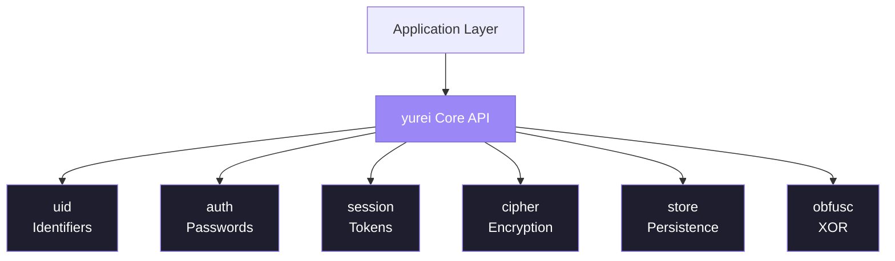
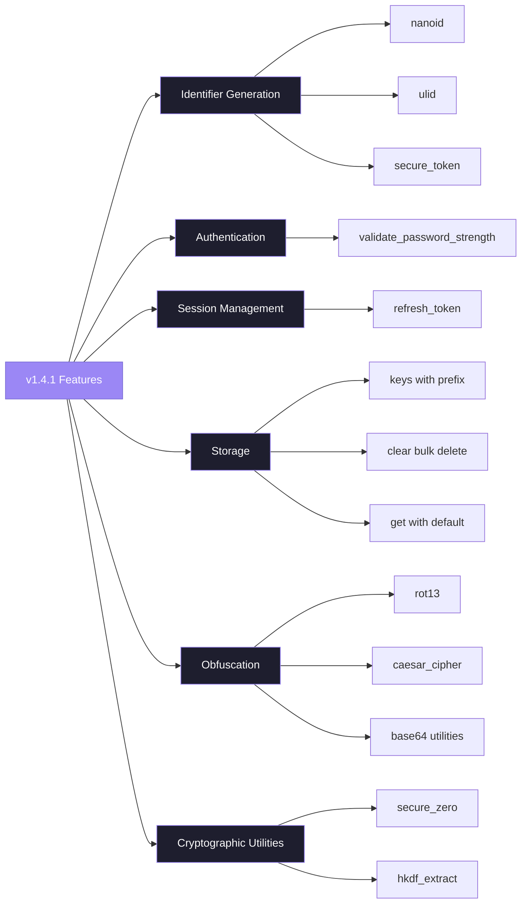
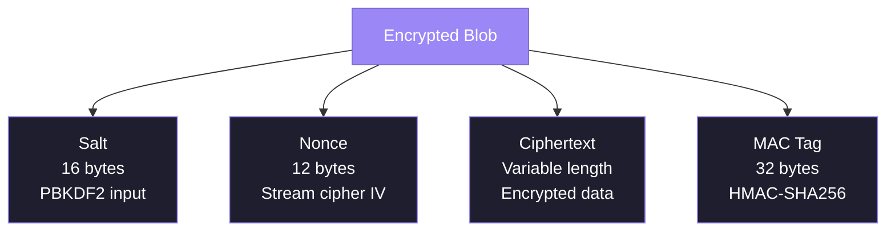
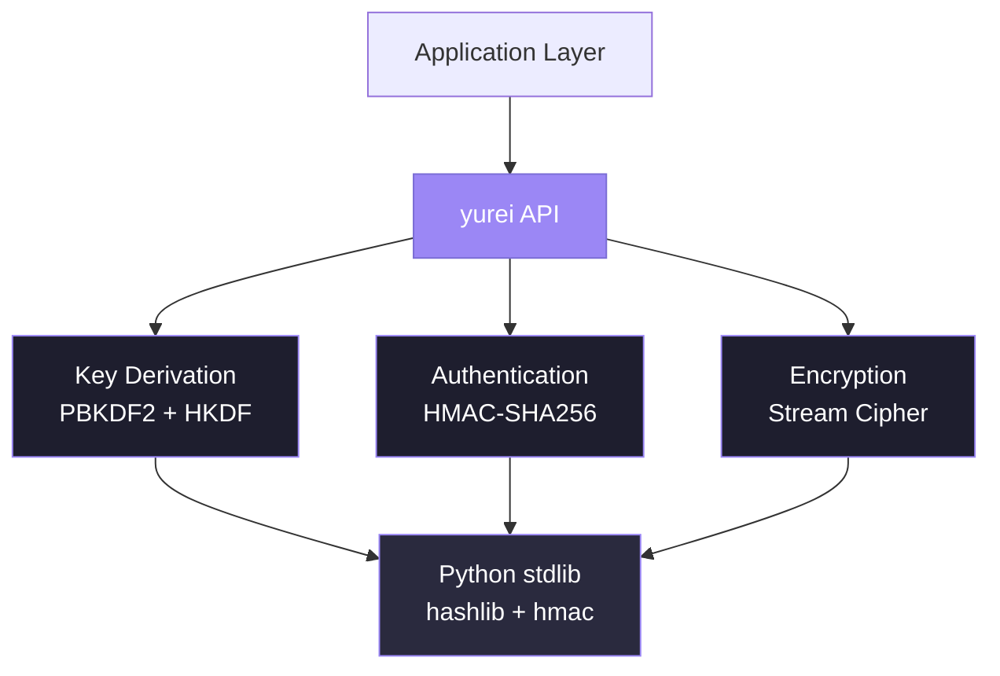

<div align="center">
<!--
<h1 align="center">
$${\color{#9b87f5}y}{\color{#8b7ae5}u}{\color{#7b6dd5}r}{\color{#6b60c5}e}{\color{#5b53b5}i}$$
</h1>
-->

<a href="https://github.com/ogkae/yurei/fork"></a> 

|[](https://github.com/ogkae/yurei) [](https://www.python.org) [](./LICENSE) [](https://github.com/ogkae/yurei/stargazers) |
|----|

*Lightweight cryptographic primitives for modern Python applications*

</div>

---

## Table of Contents

- [**Table of contents**](#table-of-contents)
- [Overview](#overview)
- [Installation](#installation)
- [Quick Start](#quick-start)
- [What's New in v1.4.1](#whats-new-in-v141)
- [API Reference:](#api-reference)
  - [`uid` - Identifier Generation](#uid---identifier-generation)
  - [`auth` - Password Hashing](#auth---password-hashing)
  - [`session` - Token Management](#session---token-management)
  - [`cipher` - Encryption](#cipher---encryption)
  - [`store` - Key-Value Storage](#store---key-value-storage)
  - [`obfusc` - XOR Obfuscation](#obfusc---xor-obfuscation)
- [Security Considerations](#security-considerations)
- [Contributing](#contributing)
<!-- - [Licence](#licence) (already exist)-->

---

## Overview

Yurei provides **cryptographic utilities without external dependencies**, built entirely on Python's standard library. Designed for **rapid prototyping**, **internal tooling**, and **environments with restricted package installation**.

<details>
<summary><b>Quick Example</b></summary>

```python
from yurei import encrypt_bytes, create_token, hash_password

# - encrypt sensitive data -
encrypted = encrypt_bytes(b"confidential", b"passphrase")

# - generate signed tokens with expiration -
token = create_token({"user": "alice"}, b"secret", ttl_seconds=3600)

# - hash passwords securely -
pwd_hash = hash_password("SecurePass123")
```

</details>

> [!WARNING]
> **For production systems**, prefer audited cryptographic libraries such as [`cryptography`](https://cryptography.io/) with [`AES-GCM`](https://datatracker.ietf.org/doc/html/rfc5288) or [`ChaCha20-Poly1305`](https://datatracker.ietf.org/doc/html/rfc7539). Yurei is optimised for development and internal use cases.

### Architecture



### Core Modules

| <code>Module</code> | <code>Purpose</code> | <code>Implementation</code> |
|:------:|:--------|:---------------|
| **uid** | Unique identifier generation | SHA256, CSPRNG |
| **auth** | Password hashing with salts | PBKDF2-HMAC-SHA256 (200k iterations) |
| **session** | Signed tokens with expiration | HMAC-SHA256 |
| **cipher** | Authenticated encryption | HMAC-based stream cipher |
| **store** | Key-value persistence | SQLite WAL mode, JSON serialisation |
| **obfusc** | XOR obfuscation | XOR + Base64 encoding |

```diff
 Ideal For
+ Rapid prototyping and MVPs
+ Internal tooling and automation scripts
+ Educational projects and cryptography learning
+ Environments with strict dependency constraints

 Not Suitable For
- Production systems handling sensitive data
- Compliance-regulated applications (PCI-DSS, HIPAA, GDPR)
- High-security environments requiring formal audits
- Applications requiring cryptographic certifications
```

---

## Installation

```ini
[Requirements]
python_version = 3.10+
dependencies   = none (stdlib only)
```

```bash
$ git clone https://github.com/ogkae/yurei
$ cd yurei
$ pip install -e .
```

<details>
<summary><b><code>Alternative Installation Methods</code></b></summary>

**From Source**
```bash
$ python setup.py install
```

**Development Mode with Testing Tools**
```bash
$ pip install -e ".[dev]"
```

</details>

---

## Quick Start

```python
from yurei import (
    uuid4, hash_password, verify_password,
    create_token, verify_token,
    encrypt_bytes, decrypt_bytes,
    KVStore
)
import os

# - generate unique identifiers -
user_id = uuid4()
print(f"User ID: {user_id}")

# - hash and verify passwords -
pwd_hash = hash_password("SecurePass123")
is_valid = verify_password(pwd_hash, "SecurePass123")
print(f"Password valid: {is_valid}")

# - create and verify signed tokens -
secret = os.urandom(32)
token = create_token(
    {"uid": user_id, "role": "admin"}, 
    secret, 
    ttl_seconds=3600
)
payload = verify_token(token, secret)
print(f"Token payload: {payload}")

# - encrypt and decrypt data -
encrypted = encrypt_bytes(b"sensitive data", b"strong-passphrase")
decrypted = decrypt_bytes(encrypted, b"strong-passphrase")
print(f"Decrypted: {decrypted.decode()}")

# - persistent key-value storage -
with KVStore("data.db") as db:
    db.set("user:session", {"uid": user_id, "active": True})
    session = db.get("user:session")
    print(f"Session: {session}")
```

---

## What's New in v1.4.1

Version 1.4.1 represents a **comprehensive enhancement release that strengthens Yurei's foundation across all modules**. This update delivers significant performance **improvements**, **robust security hardening**, and an **expanded feature set with over 15 new functions**, while **maintaining complete backward compatibility with version 1.4.0**.

# New Features



<details>
  <summary><b><code>Full Changes</code></b></summary>

#### Identifier Generation

**New ID formats** provide flexible options for different use cases. The `nanoid()` function generates compact 21-character URL-safe identifiers with high entropy, ideal for public-facing IDs. The `ulid()` function creates timestamp-sortable identifiers that maintain lexicographic ordering while providing randomness. For high-security scenarios, `secure_token()` generates cryptographically strong tokens suitable for API keys and reset tokens.

**Enhanced HMAC IDs** now support both hexadecimal and base64 output formats through the `hex_output` parameter, providing flexibility in how identifiers are represented.

#### Authentication & Sessions

**Password strength validation** arrives with `validate_password_strength()`, enabling policy enforcement before hashing. The function checks for minimum length, character diversity, and returns detailed feedback on any issues.

**Token refresh capability** through `refresh_token()` allows extending token lifetimes without re-authentication, essential for implementing "remember me" functionality and activity-based session extensions.

#### Storage Enhancements

**Key management** becomes more powerful with `keys()` for listing stored keys with optional prefix filtering, running 38% faster than manual iteration. The `clear()` method enables efficient bulk deletions with optional prefix matching.

**Graceful defaults** via enhanced `get()` method prevent exception handling overhead by returning user-specified default values for missing keys.

#### Obfuscation & Utilities

**Classical ciphers** expand the obfuscation toolkit with `rot13()` for self-inverse transformation and `caesar_cipher()` with configurable shift values. Simplified `base64_encode()` and `base64_decode()` wrappers provide convenience utilities.

**Memory safety** introduces `secure_zero()` for wiping sensitive data from memory, and `hkdf_extract()` exposes the HKDF extract step for advanced key derivation workflows.

</details>

---

## API Reference

### uid - Identifier Generation

Secure generation of unique identifiers for various use cases.

```python
from yurei import uuid4, is_uuid4, sha256_id, short_id

# - generate cryptographically secure UUID4
user_id = uuid4()
# Returns: "550e8400-e29b-41d4-a716-446655440000"

# - validate UUID4 format
is_valid = is_uuid4(user_id)
# Returns: True

# - create deterministic SHA256-based identifier
doc_id = sha256_id("documents", "invoice-2024", salt="secret")
# Returns: 64-character hexadecimal string

# - generate short URL-safe token
token = short_id(length=12)
# Returns: "aB3xK9mP2nQ1"
```

<details>
<summary><b><code>Technical Specifications</code></b></summary>

```ini
[UUID4]
source      = os.urandom (system CSPRNG)
format      = RFC 4122 compliant
entropy     = 122 bits

[SHA256 ID]
algorithm   = SHA256
input       = concatenated arguments + optional salt
output      = 64-character hex string (256 bits)

[Short ID]
charset     = alphanumeric (a-z, A-Z, 0-9)
length      = configurable (default: 12)
entropy     = ~71 bits (length=12)
```

</details>

```diff
+ Cryptographically secure random generation
+ Deterministic reproducibility (SHA256-based IDs)
+ Customisable token lengths
+ URL-safe character sets
```

---

### auth - Password Hashing

Industry-standard password hashing with automatic salt generation.

```python
from yurei import hash_password, verify_password

# - hash a password
pwd_hash = hash_password("SecurePass123", iterations=200_000)
# Returns: "pbkdf2$200000$<salt_b64>$<hash_b64>"

# - verify password against hash
is_valid = verify_password(pwd_hash, "SecurePass123")
# Returns: True

is_valid = verify_password(pwd_hash, "WrongPassword")
# Returns: False
```

<details>
<summary><b><code>Security Features</code></b></summary>

```ini
[Algorithm]
kdf            = PBKDF2-HMAC-SHA256
iterations     = 200,000 (default, configurable)
salt_length    = 16 bytes (128 bits)
output_length  = 32 bytes (256 bits)

[Protection]
timing_attacks = constant-time comparison (hmac.compare_digest)
rainbow_tables = random salt per password
dictionary     = high iteration count
```

</details>

```diff
+ Constant-time comparison (prevents timing attacks)
+ Random salts (prevents rainbow table attacks)
+ Configurable iterations (future-proof against hardware advances)
+ Standard PBKDF2-HMAC-SHA256 (widely audited)
```

---

### session - Token Management

Generate and verify signed tokens with automatic expiration handling.

```python
from yurei import create_token, verify_token
import os

secret = os.urandom(32)

# - create signed token with payload -
token = create_token( 
    payload={"uid": "user123", "role": "admin"},
    secret=secret,
    ttl_seconds=3600  # 1 hour expiration
)
# Returns: "<payload_b64>.<signature_b64>"

# - verify and extract payload -
payload = verify_token(token, secret)
# Returns: {"uid": "user123", "role": "admin"}
# Returns: None if invalid or expired
```

<details>
<summary><b><code>Token Format Specification</code></b></summary>

**Structure:**
```
<base64url(json_payload)>.<base64url(hmac_signature)>
```

**Example:**
```
eyJ1aWQiOiJ1c2VyMTIzIiwiZXhwIjoxNzM1MDAwMDAwfQ.a8f3KmN9pQ2xR5tY7uI1oP3sK6vL4wM
```

**Payload Contents:**
```json
{
  "uid": "user123",
  "role": "admin",
  "exp": 1735000000  // Unix timestamp (automatically added)
}
```

```ini
[Signature]
algorithm    = HMAC-SHA256
input        = base64url(json_payload)
output       = 32 bytes, base64url encoded
verification = constant-time comparison
```

</details>

```diff
+ HMAC-SHA256 signature verification
+ Automatic expiration handling
+ JSON payload serialisation
+ URL-safe base64 encoding
```

---

### cipher - Encryption

Authenticated encryption with support for parallel processing of large files.

#### Basic Encryption

```python
from yurei import encrypt_bytes, decrypt_bytes

plaintext = b"Sensitive information"
key = b"my-secure-passphrase"  # (any length accepted)

# - encrypt data -
encrypted = encrypt_bytes(plaintext, key)
# Returns: base64url(salt + nonce + ciphertext + mac)

# - decrypt data -
decrypted = decrypt_bytes(encrypted, key)
# Returns: b"Sensitive information"
# Raises: ValueError if MAC verification fails
```

#### Parallel Encryption

For large files, parallel processing significantly improves performance.

```python
from yurei import encrypt_parallel, decrypt_parallel

# - read large file -
with open("large_file.bin", "rb") as f:
    plaintext = f.read()

# - encrypt using multiple workers -
encrypted = encrypt_parallel(
    plaintext=plaintext,
    key=b"my-secure-key",
    chunk_size=1024*1024,  # 1 MB chunks
    workers=4              # CPU cores to utilise
)

# - decrypt using parallel processing -
decrypted = decrypt_parallel(
    encrypted, 
    key=b"my-secure-key", 
    workers=4
)
```



```ini
[Key Derivation]
stage_1    = PBKDF2-HMAC-SHA256 (100k iterations)
stage_2    = HKDF-SHA256 (key expansion)
salt       = 16 bytes random (per encryption)
output     = 64 bytes (encryption key + MAC key)

[Encryption]
scheme     = HMAC-based PRF stream cipher
mode       = Encrypt-then-MAC
nonce      = 12 bytes random (per encryption)
block_size = 64 bytes

[Authentication]
mac           = HMAC-SHA256
input         = salt + nonce + ciphertext
output        = 32 bytes
verification  = constant-time comparison
```

```diff
 Authenticated encryption (Encrypt-then-MAC)
+ Parallel processing support (large files)
+ Random salt and nonce per encryption
+ Constant-time MAC verification
+ Key derivation from arbitrary-length passphrases

 Custom stream cipher (not AES-GCM/ChaCha20-Poly1305)
- No formal security audit
- Not suitable for high-security environments
```

---

### store - Key-Value Storage

Simple persistent storage with SQLite backend or in-memory operation.

```python
from yurei import KVStore

# - inmemory storage (no persistence) -
db = KVStore()

# - SQLite-backed storage (persisted to disk) -
db = KVStore("data.db")

# - store data (automatic JSON serialisation) -
db.set("user:123", {"name": "Alice", "email": "alice@example.com"})

# - retrieve data -
user = db.get("user:123")
# Returns: {"name": "Alice", "email": "alice@example.com"}

missing = db.get("user:999")
# Returns: None

# - check existence -
exists = db.exists("user:123")
# Returns: True

# - delete data -
db.delete("user:123")

# - context manager (automatic cleanup) -
with KVStore("data.db") as db:
    db.set("key", {"value": "data"})
    # Automatically closed after block
```

<details>
<summary><b><code>Storage Backend Details</code></b></summary>

```ini
[SQLite Configuration]
journal_mode = WAL (Write-Ahead Logging)
synchronous  = NORMAL
temp_store   = MEMORY

[Schema]
table     = kv_store
columns   = key TEXT PRIMARY KEY, value TEXT
index     = PRIMARY KEY on key
encoding  = JSON serialisation

[Operations]
get       = O(log n) with B-tree index
set       = O(log n) with WAL buffering
delete    = O(log n)
exists    = O(log n)
```

</details>

```diff
+ Automatic JSON serialisation/deserialisation
+ SQLite WAL mode (concurrent reads)
+ In-memory mode available (no I/O overhead)
+ Context manager support (automatic cleanup)
```

---

### obfusc - XOR Obfuscation

> [!WARNING]
> **Not cryptographically secure.** XOR obfuscation provides **zero protection** against determined attackers. Use only for non-security purposes.

```python
from yurei import xor_obfuscate, xor_deobfuscate

original = "Sensitive text"
key = "secret-key"

# - obfuscate string -
obfuscated = xor_obfuscate(original, key)
# Returns: base64-encoded XOR result

# - deobfuscate string -
restored = xor_deobfuscate(obfuscated, key)
# Returns: "Sensitive text"
```

<details>
<summary><b><code>Technical Details</code></b></summary>

```ini
[Algorithm]
operation = XOR (bitwise exclusive OR)
key       = repeating key stream
encoding  = base64 (output encoding)

[Security]
strength       = none (trivially reversible)
key_secrecy    = does not provide confidentiality
integrity      = no authentication/tampering detection
```

**How It Works:**
```
plaintext:  "HELLO"
key:        "KEY" (repeating)
XOR result: [binary data]
output:     base64(XOR result)
```

</details>

```diff
 Appropriate Use Cases
+ Deterring casual inspection of configuration files
+ Obfuscating hardcoded strings in source code
+ Basic data mangling for non-security purposes
+ Lightweight encoding/decoding without dependencies

 Inappropriate Use Cases
- Protecting passwords or credentials
- Encrypting sensitive personal data
- Authentication tokens or session identifiers
- Any security-critical application
- Protection against skilled attackers
```

---

## Security Considerations

### Cryptographic Architecture



### Cryptographic Primitives

| Component | Algorithm | Parameters | Standard |
|:----------|:----------|:-----------|:---------|
| **Password KDF** | PBKDF2-HMAC-SHA256 | 200k iterations, 16B salt, 32B output | NIST SP 800-132 |
| **Encryption KDF** | PBKDF2 + HKDF | 100k iterations, key expansion | NIST SP 800-108 |
| **MAC** | HMAC-SHA256 | 32B output, constant-time verify | FIPS 198-1 |
| **Cipher** | HMAC-based PRF stream | 12B nonce, Encrypt-then-MAC | Custom design |
| **CSPRNG** | `os.urandom` | System entropy source | Platform-dependent |

<details>
<summary><b><code>Security Strengths</code></b></summary>

```diff
+ Uses well-established primitives (PBKDF2, HMAC, SHA256)
+ Constant-time comparison for MAC/password verification
+ Random salts and nonces prevent replay attacks
+ High iteration counts resist brute-force attacks
+ Encrypt-then-MAC construction (recommended pattern)
+ No external dependencies (reduced supply chain risk)
```

</details>

<details>
<summary><b><code>Security Limitations</code></b></summary>

```diff
- Custom stream cipher (not AES-GCM or ChaCha20-Poly1305)
- No formal security audit or peer review
- No side-channel attack analysis
- Limited cryptanalysis compared to standard algorithms
- Not suitable for compliance-regulated environments
- Cannot guarantee security against nation-state adversaries
```

</details>

### Alternative Solutions

For production environments, consider these audited alternatives:

| <code>Library</code> | <code>Algorithm</code> | <code>Use Case</code> |
|:--------|:----------|:---------|
| [`cryptography`](https://cryptography.io/) | AES-GCM, ChaCha20-Poly1305 | General-purpose encryption |
| [`bcrypt`](https://github.com/pyca/bcrypt/) | bcrypt | Password hashing |
| [`PyNaCl`](https://pynacl.readthedocs.io/) | NaCl/libsodium | High-level cryptography API |
| [`argon2-cffi`](https://github.com/hynek/argon2-cffi) | Argon2 | Modern password hashing |

---

## Contributing

**Contributions are welcome!** Please review the [<code>CONTRIBUTING.md</code>](./CONTRIBUTING.md) guidelines before submitting.

### Priority Development Areas

| <code>Area</code> | <code>Description</code> | <code>Skills Required</code> |
|:-----|:------------|:----------------|
| **Test Coverage** | Comprehensive unit and integration tests | Python, pytest, hypothesis |
| **Benchmarking** | Performance profiling and optimisation | Python profiling tools, cProfile |
| **Streaming API** | Memory-efficient chunked encryption | Python generators, async/await |
| **Key Rotation** | Graceful cryptographic key migration | Cryptography, design patterns |
| **Documentation** | API reference, tutorials, examples | Technical writing, Markdown |

### Development Setup

```bash
# - clone repository -
git clone https://github.com/ogkae/yurei
cd yurei

# - install development dependencies -
pip install -e ".[dev]"

# - run test suite -
pytest tests/ -v

# - run linter -
ruff check .

# - format code -
black .

# - type checking -
mypy yurei/
```

<details>
<summary><b><code>Contribution Workflow</code></b></summary>

1. Fork the repository
2. Create a feature branch (`git checkout -b feature/amazing-feature`)
3. Commit your changes (`git commit -m 'Add amazing feature'`)
4. Push to the branch (`git push origin feature/amazing-feature`)
5. Open a Pull Request

**Code Standards:**
- Follow PEP 8 style guidelines
- Add type hints for all public functions
- Write docstrings for all modules, classes, and functions
- Include unit tests for new functionality
- Update documentation as needed

</details>

---

### Contributors

<div align="center">

|[](https://github.com/ogkae/yurei/graphs/contributors)|
|-|

<br></br>

[`↑ Back to Top`](#table-of-contents)

<br></br>


| Licensed under the [`MIT Licence`](./LICENSE)<br></br><a href="https://discord.com/users/1394747147106254949"></a><a href="https://github.com/hexa-hosting"></a><a href="https://bento.me/ogkae"></a> |
|:----:|

</div>
<!-- (Also distributed under the [Toaster Licence 2025](./TOASTER-LICENSE))  || 10/10/2025 - 24/12/2025 -->
